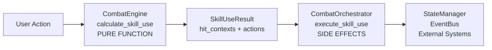
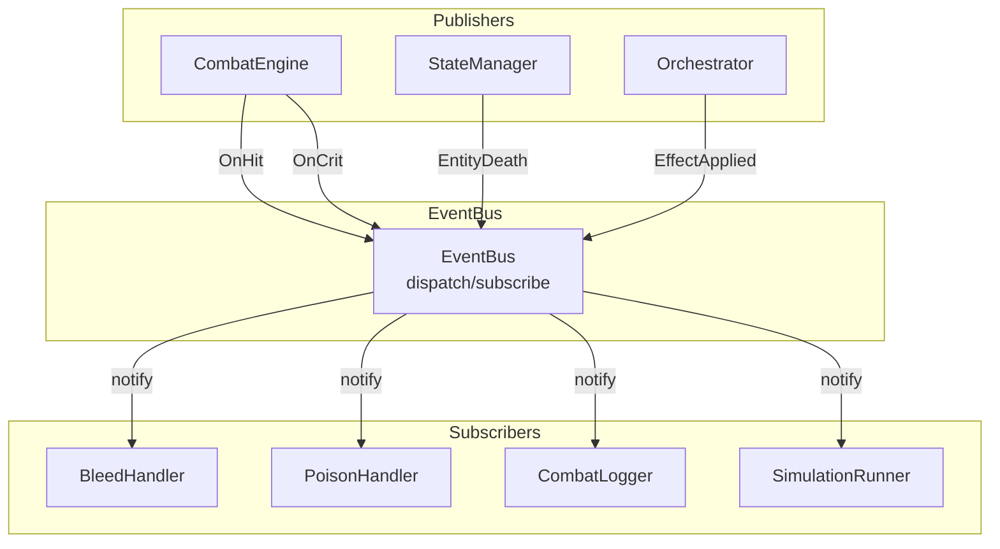
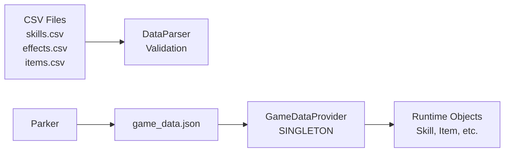
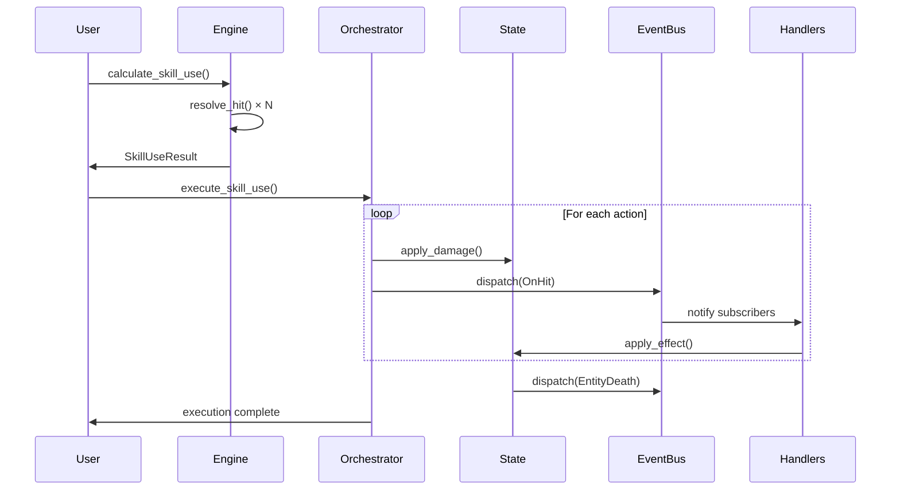
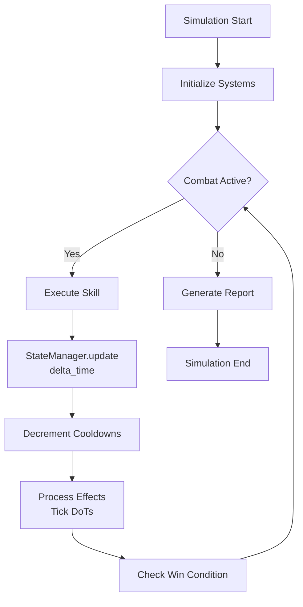
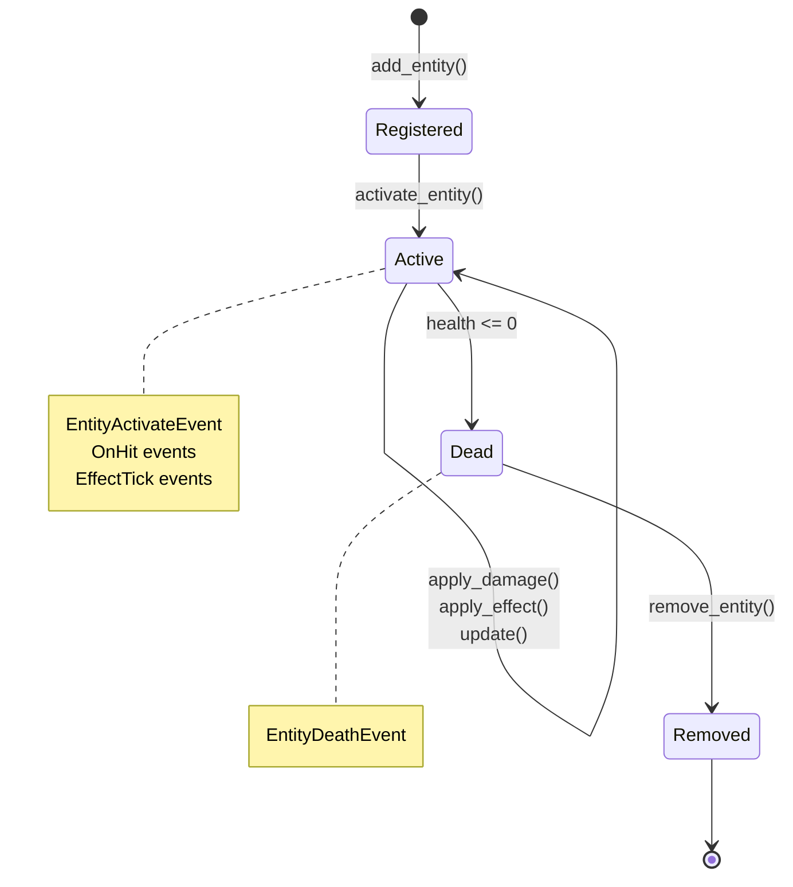

# Combat Engine Architecture

*Complete architectural overview of the production-ready combat system*

## Table of Contents

1. [Overview](#overview)
2. [Package Structure](#package-structure)
3. [Core Architectural Patterns](#core-architectural-patterns)
4. [System Integration](#system-integration)
5. [Data Flow](#data-flow)
6. [Module Details](#module-details)

## Overview

The Combat Engine is a modular, event-driven RPG combat system built with production-quality architecture. The system separates calculation from execution, uses dependency injection for testability, and provides a data-driven content pipeline for easy extensibility.

**Key Design Principles:**
- **Separation of Concerns**: Pure calculation functions separated from state-mutating execution
- **Event-Driven Architecture**: Loose coupling through observer pattern (EventBus)
- **Data-Driven Content**: Skills, items, effects, and entities defined in CSV files, not code
- **Deterministic Testing**: Injectable RNG for reproducible test results
- **Data-Driven Entities**: Runtime entity creation from CSV templates with procedural equipment
- **Type Safety**: Comprehensive type hints and validation throughout

## Package Structure

```
src/
├── combat/          # Combat calculation and orchestration
│   ├── engine.py           # Pure damage calculation functions
│   ├── orchestrator.py     # Action execution with dependency injection
│   ├── combat_math.py      # Low-level combat math utilities
│   └── hit_context.py      # Hit result data structures
│
├── core/            # Core data models and systems
│   ├── models.py           # Entity, stats, items, actions
│   ├── factory.py          # EntityFactory for data-driven entity creation
│   ├── state.py            # StateManager (health, effects, lifecycle)
│   ├── events.py           # EventBus and event definitions
│   ├── rng.py              # Single, injectable RNG class
│   └── skills.py           # Skill and trigger data models
│
├── data/            # Data loading and validation
│   ├── game_data_provider.py  # Singleton data access
│   ├── data_parser.py          # CSV parsing logic
│   ├── schemas.py              # Data validation schemas
│   └── typed_models.py         # TypedDict definitions
│
├── handlers/        # Effect and event handlers
│   └── effect_handlers.py     # DoT handlers (Bleed, Poison, etc.)
│
├── simulation/      # Batch simulation and analysis
│   ├── combat_simulation.py   # Single combat simulation
│   ├── batch_runner.py         # Batch execution framework
│   ├── aggregators.py          # Statistical analysis (DPS, win rate)
│   ├── telemetry.py            # Multi-mode logging
│   └── exporters.py            # JSON/CSV data export
│
└── utils/           # Utility modules
    └── item_generator.py       # Procedural item generation
```

**Data Files:**
```
data/
├── entities.csv         # Entity templates with stats and equipment pools
├── skills.csv           # Skills and their trigger conditions
├── effects.csv          # Effect definitions for DoTs and buffs
├── items.csv            # Item templates with affixes and properties
├── affixes.csv          # Random affix definitions for proc effects
├── loot_tables.csv      # Loot drop tables with weights and recursion
└── quality_tiers.csv    # Item quality tiers and rarity probabilities
```

## Core Architectural Patterns

### 1. Action/Result Pattern (Calculation ↔ Execution Separation)

The engine uses a pure functional core with imperative shell pattern:



**Benefits:**
- **Testability**: Calculation logic tested without mocking external systems
- **Godot Compatibility**: Direct translation to signal-based architecture
- **Separation of Concerns**: Business logic isolated from side effects

**Example:**

```python
# Pure calculation (no side effects)
from src.combat.engine import CombatEngine
engine = CombatEngine()
result = engine.calculate_skill_use(attacker, defender, skill, state_manager)

# Separate execution phase
from src.combat.orchestrator import CombatOrchestrator
orchestrator = CombatOrchestrator(state_manager, event_bus)
orchestrator.execute_skill_use(result)
```

### 2. Event-Driven Communication (Observer Pattern)

The EventBus decouples systems through publish/subscribe:



**Event Types:**
- **Combat Events**: `OnHit`, `OnCrit`, `OnBlock`, `OnDodge`
- **Lifecycle Events**: `EntitySpawn`, `EntityActivate`, `EntityDeath`, `EntityDespawn`
- **Effect Events**: `EffectApplied`, `EffectTick`, `EffectExpired`

### 3. Dependency Injection

All systems accept dependencies through constructors for testability:

```python
# Systems are composable and testable
event_bus = EventBus()
state_manager = StateManager(event_bus)
engine = CombatEngine(rng=make_rng(42))  # Deterministic
orchestrator = CombatOrchestrator(state_manager, event_bus)

# Handlers register themselves with the event bus
bleed_handler = BleedHandler(event_bus, state_manager, rng=make_rng(100))
```

### 4. Data-Driven Content Pipeline

All game content flows from CSV → JSON → Runtime:



**Advantages:**
- Add new skills/items without code changes
- Hot-reload data during development
- Cross-reference validation at load time
- Type-safe access through TypedDict models

## System Integration

### Combat Flow: Complete Execution Path



### Time-Based Simulation Loop



## Data Flow

### Damage Calculation Pipeline

See [damage_pipeline.md](file:///g:/Godot%20Projects/combat_engine/docs/damage_pipeline.md) for detailed step-by-step breakdown.

High-level flow:

```
Attacker Stats + Defender Stats
    ↓
[1] Evasion Check (glancing/dodge)
    ↓
[2] Critical Hit Roll (tier-based)
    ↓
[3] Pre-Pierce Crit Multiplier
    ↓
[4] Defense Application (armor)
    ↓
[5] Pierce Formula
    ↓
[6] Post-Pierce Crit Multiplier
    ↓
[7] Block Check
    ↓
[8] Resistance Application
    ↓
[9] Final Damage Clamping
    ↓
HitContext Result
```

### State Management Lifecycle

See [state_and_lifecycle.md](file:///g:/Godot%20Projects/combat_engine/docs/state_and_lifecycle.md) for complete details.



## Module Details

### Combat Package (`src/combat/`)

#### `engine.py` - CombatEngine
**Purpose**: Pure damage calculation functions

**Key Methods:**
- `resolve_hit()`: Single hit damage calculation (9-step pipeline)
- `calculate_skill_use()`: Multi-hit skill calculation (returns `SkillUseResult`)
- `calculate_effective_damage()`: Damage breakdown for analysis
- `validate_damage_calculation()`: Input validation

**Design**: Static class with injectable RNG for determinism

#### `orchestrator.py` - CombatOrchestrator
**Purpose**: Execute actions with side effects

**Key Methods:**
- `execute_skill_use()`: Execute `SkillUseResult` actions
- `_execute_action()`: Dispatch individual actions

**Design**: Dependency injection of `StateManager` and `EventBus`

#### `combat_math.py`
**Purpose**: Low-level math utilities

**Functions:**
- `evade_dodge_or_normal()`: Evasion mechanics
- `resolve_crit()`: Critical hit tier calculation
- `apply_pierce_to_armor()`: Pierce formula
- `calculate_pierce_damage_formula()`: MAX((dmg - def), (dmg × pierce))

### Core Package (`src/core/`)

#### `models.py`
**Purpose**: Core data structures

**Key Classes:**
- `EntityStats`: Static combat statistics
- `Entity`: Combat participant with equipment
- `Item`, `RolledAffix`: Procedural itemization
- `Action` hierarchy: `ApplyDamageAction`, `DispatchEventAction`, `ApplyEffectAction`
- `EffectInstance`: Runtime status effect

#### `factory.py` - EntityFactory
**Purpose**: Data-driven entity creation from CSV templates (Phase B2)

**Key Methods:**
- `create()`: Hydrate EntityTemplate into equipped Entity instance
- `_equip_entity()`: Resolve equipment pools into generated items
- `_resolve_item_id()`: Dual-strategy equipment selection (direct ID vs pool lookup)

**Features:**
- Deterministic equipment generation with injected RNG
- Cross-reference validation with GameDataProvider
- Equipment pool resolution from templates

#### `state.py` - StateManager
**Purpose**: Dynamic entity state tracking and lifecycle management (refactored for v2.3.0)

**Responsibilities:**
- Full entity lifecycle management (registration, activation, death, removal)
- Health, resource, cooldown management
- Effect application, tracking, and ticking
- Lifecycle event dispatching via EventBus
- Time-based simulation updates
- Enhanced state reset and initialization hooks

See [state_and_lifecycle.md](file:///g:/Godot%20Projects/combat_engine/docs/state_and_lifecycle.md)

#### `events.py` - EventBus
**Purpose**: Decoupled event system (enhanced for v2.3.0)

**Features:**
- Type-safe event classes
- Subscribe/dispatch pattern
- Wildcard event listeners
- Deterministic delivery order
- Supports key lifecycle events: `EntitySpawnEvent`, `EntityActivateEvent`, `EntityDeathEvent`, `EntityDespawnEvent`, `EffectApplied`, `EffectTick`, `EffectExpired`.

### Data Package (`src/data/`)

See [data_pipeline.md](file:///g:/Godot%20Projects/combat_engine/docs/data_pipeline.md) for complete pipeline documentation.

#### `game_data_provider.py` - GameDataProvider
**Purpose**: Singleton data access

**Features:**
- Centralized JSON loading
- Hot-reload capability
- Cross-reference validation
- Error resilience

### Simulation Package (`src/simulation/`)

#### `batch_runner.py` - SimulationBatchRunner
**Purpose**: High-volume deterministic testing

**Features:**
- Batch execution with seed management
- Statistical aggregation
- Telemetry modes (DEBUG/INFO/ERROR)
- Memory cleanup between runs

## Testing Architecture

**Test Coverage**: 276 tests, 100% pass rate

**Key Test Files:**
- `test_engine.py`: Combat calculation logic
- `test_state.py`: StateManager functionality
- `test_event_bus_pr3.py`: Event system
- `test_integration.py`: End-to-end scenarios
- `test_batch_determinism.py`: Reproducibility validation

**Testing Conventions:**
```python
from tests.fixtures import make_rng, make_attacker, make_defender

# All tests use deterministic RNG
engine = CombatEngine(rng=make_rng(42))
attacker = make_attacker(base_damage=100.0)
defender = make_defender(armor=50.0)
```

## Performance Characteristics

- **Combat Calculation**: < 1ms per hit
- **Effect Processing**: < 0.2ms per tick
- **Data Loading**: < 5ms (69 items, 63 affixes, 35 effects)
- **Simulation Throughput**: 6993 events/second

## Godot Port Compatibility

The architecture translates directly to Godot:

| Python Pattern | Godot Equivalent |
|----------------|------------------|
| `SkillUseResult` | Signal emission |
| `Action` classes | Signal parameters |
| `EventBus` | Godot signals/groups |
| `CombatOrchestrator` | Scene nodes with injected dependencies |
| `GameDataProvider` | Resource loading |

---

**Last Updated**: November 20, 2025  
**Version**: Combat Engine v2.5.0  
**Status**: Production-Ready
