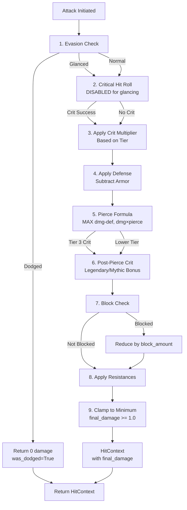

# Damage Calculation Pipeline

*Detailed walkthrough of the 9-step combat damage resolution system*

## Overview

The Combat Engine implements a sophisticated damage calculation pipeline following the Game Design Document (GDD) specifications. Every hit goes through a 9-step process that determines whether the attack lands, if it critically hits, how defenses mitigate damage, and what the final damage value is.

This document provides a step-by-step breakdown of the `CombatEngine.resolve_hit()` method with code examples and calculations.

## The 9-Step Pipeline



## Detailed Step Breakdown

### Step 1: Evasion Check (Dodge/Glancing)

**Code Location**: `CombatEngine._perform_evasion_check()`

The defender has two chances to avoid full damage:

1. **Glancing Hit** (0 to `evasion_chance`, max 75%)
   - Reduces damage by 50%
   - Disables critical hits
   - Still counts as a hit

2. **Full Dodge** (`evasion_chance` to `evasion_chance + dodge_chance`)
   - Completely avoids damage
   - Sets `final_damage = 0`
   - Ends the pipeline early

**Calculation:**
```python
evasion_chance = defender.final_stats.evasion_chance  # 0.0 to 0.75
dodge_chance = defender.final_stats.dodge_chance      # 0.0 to 1.0

# Apply modifiers from StateManager (buffs/debuffs)
final_evasion = _get_modified_chance(defender, state_manager, evasion_chance, "evasion")
final_dodge = _get_modified_chance(defender, state_manager, dodge_chance, "dodge")

roll = rng()  # 0.0 to 1.0

if roll < final_evasion:
    return (was_dodged=False, was_glanced=True)
elif roll < final_evasion + final_dodge:
    return (was_dodged=True, was_glanced=False)
else:
    return (was_dodged=False, was_glanced=False)
```

**Example:**
```
Defender: evasion_chance=0.25, dodge_chance=0.15
Roll: 0.18

0.18 < 0.25 → Glancing hit!
Damage will be halved, no crits possible
```

### Step 2: Critical Hit Roll

**Code Location**: `CombatEngine.resolve_hit()` around line 130

The attacker rolls for a critical hit based on their crit chance:

**Calculation:**
```python
crit_chance = attacker.final_stats.crit_chance  # 0.0 to 1.0

# Apply modifiers (e.g., +10% crit chance from buff)
final_crit_chance = _get_modified_chance(attacker, state_manager, crit_chance, "crit")

# Critical hits disabled for glancing hits
if was_glanced:
    is_crit = False
    crit_tier = 0
else:
    roll = rng()
    is_crit = roll < final_crit_chance
    crit_tier = attacker.get_crit_tier() if is_crit else 0
```

**Critical Hit Tiers** (based on attacker rarity):
- **Tier 1** (Common/Uncommon): Base crit (currently unused, reserved for future GDD updates)
- **Tier 2** (Rare/Epic): Pre-mitigation damage multiplier
- **Tier 3** (Legendary/Mythic): Pre-mitigation AND post-mitigation multiplier

**Example:**
```
Attacker: crit_chance=0.30, rarity=Epic (Tier 2)
Roll: 0.22

0.22 < 0.30 → Critical hit!
crit_tier = 2 (will apply pre-pierce multiplier)
```

### Step 3: Pre-Pierce Critical Hit Multiplier

**Code Location**: `CombatEngine._apply_pre_pierce_crit()`

For **Tier 2** crits (Rare/Epic), the crit multiplier applies to all pre-mitigation damage:

**Calculation:**
```python
if crit_tier == 2:
    crit_multiplier = attacker.final_stats.crit_damage  # Default: 1.5
    
    # Apply to base damage and all flat bonuses
    ctx.base_damage *= crit_multiplier
    ctx.armor_penetration *= crit_multiplier
    ctx.damage_from_affixes *= crit_multiplier
```

**Example:**
```
Tier 2 Crit with crit_damage=2.0:

Before crit:
  base_damage = 100.0
  armor_penetration = 20.0
  damage_from_affixes = 15.0
  
After crit:
  base_damage = 200.0
  armor_penetration = 40.0
  damage_from_affixes = 30.0
  total_pre_pierce = 270.0
```

### Step 4: Defense Application (Armor Subtraction)

**Code Location**: `CombatEngine.resolve_hit()` around line 150

Defender's armor reduces incoming damage:

**Calculation:**
```python
total_pre_pierce_damage = (
    ctx.base_damage + 
    ctx.armor_penetration + 
    ctx.damage_from_affixes
)

defender_armor = defender.final_stats.armor
damage_after_armor = total_pre_pierce_damage - defender_armor
```

**Example:**
```
total_pre_pierce_damage = 270.0
defender_armor = 80.0

damage_after_armor = 270.0 - 80.0 = 190.0
```

### Step 5: Pierce Formula (Core Damage Calculation)

**Code Location**: `calculate_pierce_damage_formula()` in `combat_math.py`

This is the **signature formula** of the combat system:

**Formula:**
```
final_damage = MAX(
    damage_after_armor,
    total_pre_pierce_damage × pierce_ratio
)
```

The damage is the **greater of**:
1. Damage after armor reduction
2. Raw damage times pierce ratio (ignoring armor)

**Calculation:**
```python
pierce_ratio = attacker.final_stats.pierce_ratio  # Min: 0.01

pierced_damage = total_pre_pierce_damage * pierce_ratio
final_damage = max(damage_after_armor, pierced_damage)
```

**Example:**
```
total_pre_pierce_damage = 270.0
pierce_ratio = 0.25
defender_armor = 80.0

Option A: 270.0 - 80.0 = 190.0 (armor reduction)
Option B: 270.0 × 0.25 = 67.5 (pierce)

final_damage = MAX(190.0, 67.5) = 190.0
```

**Pierce Effectiveness:**
High pierce ratio helps against high-armor targets:
```
Scenario: pierce_ratio = 0.80, armor = 200.0, damage = 270.0

Option A: 270.0 - 200.0 = 70.0
Option B: 270.0 × 0.80 = 216.0

final_damage = MAX(70.0, 216.0) = 216.0
Pierce bypassed most of the armor!
```

### Step 6: Post-Pierce Critical Hit Multiplier

**Code Location**: `CombatEngine._apply_post_pierce_crit()`

For **Tier 3** crits (Legendary/Mythic), an additional multiplier applies AFTER pierce:

**Calculation:**
```python
if crit_tier == 3:
    crit_multiplier = attacker.final_stats.crit_damage
    ctx.final_damage *= crit_multiplier
```

This makes Tier 3 crits extremely powerful as they bypass armor reduction.

**Example:**
```
Tier 3 Crit with crit_damage=2.5:

After pierce: final_damage = 190.0
After Tier 3 crit: final_damage = 190.0 × 2.5 = 475.0
```

### Step 7: Block Check

**Code Location**: `CombatEngine._perform_block_check()` and `apply_block_damage()`

The defender can block to reduce damage:

**Calculation:**
```python
block_chance = defender.final_stats.block_chance  # 0.0 to 1.0
final_block_chance = _get_modified_chance(defender, state_manager, block_chance, "block")

roll = rng()
was_blocked = roll < final_block_chance

if was_blocked:
    block_amount = defender.final_stats.block_amount
    ctx.final_damage = max(1.0, ctx.final_damage - block_amount)
```

**Example:**
```
block_chance = 0.40
block_amount = 50.0
Roll: 0.32

0.32 < 0.40 → Blocked!

Before block: final_damage = 475.0
After block: final_damage = 475.0 - 50.0 = 425.0
```

### Step 8: Resistance Application

**Code Location**: `CombatEngine.resolve_hit()` around line 180

Resistances provide a percentage reduction:

**Calculation:**
```python
resistances = defender.final_stats.resistances  # 0.0 to 1.0
ctx.final_damage *= (1.0 - resistances)
```

**Example:**
```
resistances = 0.15 (15% reduction)
final_damage = 425.0

final_damage = 425.0 × (1.0 - 0.15) = 425.0 × 0.85 = 361.25
```

### Step 9: Minimum Damage Clamping

**Code Location**: `clamp_min_damage()` in `combat_math.py`

Ensure damage is always at least 1.0 (no zero-damage hits):

**Calculation:**
```python
ctx.final_damage = max(1.0, ctx.final_damage)
```

**Example:**
```
If after all reductions: final_damage = 0.3
Clamped: final_damage = 1.0

Minimum damage guaranteed!
```

## Complete Example: Full Pipeline Execution

Let's trace a complete hit from start to finish:

### Setup
```python
Attacker:
  - base_damage: 100.0
  - crit_chance: 0.30
  - crit_damage: 2.0
  - pierce_ratio: 0.25
  - rarity: Epic (Tier 2 crit)

Defender:
  - armor: 60.0
  - evasion_chance: 0.20
  - dodge_chance: 0.10
  - block_chance: 0.30
  - block_amount: 25.0
  - resistances: 0.10
```

### Execution

**Step 1: Evasion Check**
```
Roll: 0.45
0.45 > 0.20 + 0.10 = 0.30 → Normal hit (not glanced, not dodged)
```

**Step 2: Crit Roll**
```
Roll: 0.25
0.25 < 0.30 → Critical hit! (Tier 2)
```

**Step 3: Pre-Pierce Crit**
```
base_damage = 100.0
Tier 2 crit_damage = 2.0
After crit: base_damage = 200.0
```

**Step 4: Defense**
```
total_pre_pierce = 200.0
armor = 60.0
damage_after_armor = 200.0 - 60.0 = 140.0
```

**Step 5: Pierce Formula**
```
Option A (armor): 140.0
Option B (pierce): 200.0 × 0.25 = 50.0
final_damage = MAX(140.0, 50.0) = 140.0
```

**Step 6: Post-Pierce Crit**
```
Not Tier 3, skip this step
final_damage = 140.0
```

**Step 7: Block Check**
```
Roll: 0.82
0.82 > 0.30 → Not blocked
final_damage = 140.0
```

**Step 8: Resistances**
```
resistances = 0.10
final_damage = 140.0 × 0.90 = 126.0
```

**Step 9: Clamp**
```
126.0 >= 1.0 → No change needed
final_damage = 126.0
```

### Final Result

```python
HitContext(
    final_damage=126.0,
    was_crit=True,
    crit_tier=2,
    was_dodged=False,
    was_glanced=False,
    was_blocked=False
)
```

## Glancing Hit Example

Let's see how glancing hits change the calculation:

**Step 1: Evasion Check**
```
Roll: 0.15
0.15 < 0.20 → Glancing hit!
```

**Step 2: Crit Roll**
```
Glancing hit → Crit disabled
is_crit = False
crit_tier = 0
```

**After Pierce:**
```
base_damage = 100.0 (no crit multiplier)
damage_after_armor = 100.0 - 60.0 = 40.0
pierced = 100.0 × 0.25 = 25.0
final_damage = MAX(40.0, 25.0) = 40.0
```

**Glancing Penalty Applied:**
```python
if was_glanced:
    final_damage *= 0.5

final_damage = 40.0 × 0.5 = 20.0
```

After resistances (0.10):
```
final_damage = 20.0 × 0.90 = 18.0
```

**Result**: `18.0` damage instead of `126.0` (85% reduction from glancing!)

## Code Reference

The complete implementation can be found in:
- **Main Pipeline**: [`src/combat/engine.py`](file:///g:/Godot%20Projects/combat_engine/src/combat/engine.py#L103-L189) - `CombatEngine.resolve_hit()`
- **Math Utilities**: [`src/combat/combat_math.py`](file:///g:/Godot%20Projects/combat_engine/src/combat/combat_math.py)
- **Hit Context**: [`src/combat/hit_context.py`](file:///g:/Godot%20Projects/combat_engine/src/combat/hit_context.py)

## Testing

The damage pipeline is extensively tested:
- **Unit Tests**: [`tests/test_engine.py`](file:///g:/Godot%20Projects/combat_engine/tests/test_engine.py)
- **Combat Math Tests**: [`tests/test_combat_math.py`](file:///g:/Godot%20Projects/combat_engine/tests/test_combat_math.py)
- **Integration Tests**: [`tests/test_integration.py`](file:///g:/Godot%20Projects/combat_engine/tests/test_integration.py)

All tests use deterministic RNG for reproducible results.

---

**Related Documentation:**
- [Architecture Overview](file:///g:/Godot%20Projects/combat_engine/docs/architecture.md)
- [State and Lifecycle](file:///g:/Godot%20Projects/combat_engine/docs/state_and_lifecycle.md)

**Last Updated**: November 20, 2025  
**Version**: Combat Engine v2.5.0
