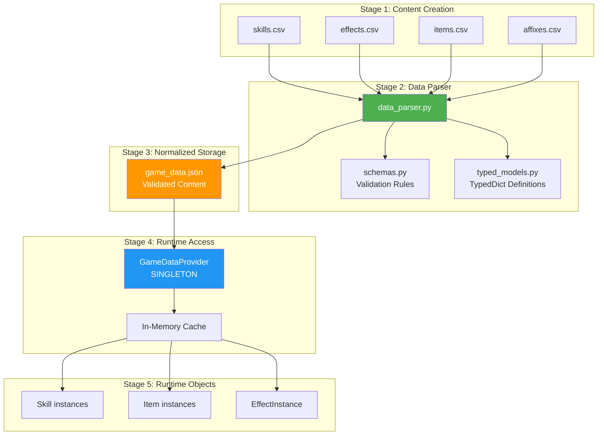

# Data Pipeline: CSV to Runtime

*Complete guide to the data loading, validation, and access pipeline*

## Overview

The combat engine uses a sophisticated data pipeline that transforms CSV files into runtime Python objects with full validation and type safety. All game content (skills, items, affixes, effects) flows through this pipeline, enabling data-driven design where new content can be added without code changes.

**Pipeline Stages:**
1. **CSV Files** → Human-readable content definition
2. **Data Parser** → CSV parsing and validation
3. **JSON Export** → Normalized game_data.json
4. **GameDataProvider** → Singleton runtime access
5. **Runtime Objects** → Skill, Item, EffectInstance creation

## Architecture Diagram



## Stage 1: CSV Content Definitions

### CSV File Formats

#### `data/skills.csv`

Defines all combat skills with triggers and effects.

**Schema:**
```csv
skill_id, name, hits, resource_cost, cooldown, trigger_event, proc_rate, trigger_result, trigger_duration, stacks_max
```

**Example:**
```csv
whirlwind, Whirlwind Strike, 3, 25.0, 8.0, OnHit, 0.5, Bleed, 10.0, 5
execute, Execute, 1, 30.0, 12.0, OnHit, 1.0, Massive_Damage, 0.0, 1
```

**Fields:**
- `skill_id`: Unique identifier
- `name`: Display name
- `hits`: Number of attacks per use
- `resource_cost`: Resource consumed on use
- `cooldown`: Seconds before reuse
- `trigger_event`: Event that activates trigger (`OnHit`, `OnCrit`, etc.)
- `proc_rate`: Probability of trigger (0.0 to 1.0)
- `trigger_result`: Effect to apply (debuff name or complex effect)
- `trigger_duration`: Duration of applied effect
- `stacks_max`: Maximum stacks allowed

#### `data/effects.csv`

Defines DoTs, buffs, and debuffs.

**Schema:**
```csv
effect_id, name, duration, tick_interval, damage_per_tick, stacks_to_add, description
```

**Example:**
```csv
bleed, Bleed, 10.0, 1.0, 5.0, 1, Causes bleeding damage over time
poison, Poison, 8.0, 1.0, 3.0, 1, Inflicts poison damage
```

#### `data/items.csv`

Defines base item templates.

**Schema:**
```csv
item_id, name, slot, rarity, affix_pool, description
```

**Example:**
```csv
iron_sword, Iron Sword, Weapon, Common, weapon, Basic weapon
legendary_helm, Legendary Helm, Helmet, Legendary, helmet;legendary, Powerful headgear
```

**Fields:**
- `affix_pool`: Comma-separated pools this item can roll from

#### `data/affixes.csv`

Defines item modifiers.

**Schema:**
```csv
affix_id, stat_affected, mod_type, affix_pools, description, base_value, trigger_event, proc_rate, ...
```

**Example:**
```csv
brutal_strike, base_damage, flat, weapon, Increases damage, 15.0, , , , , ,False,
```

Advanced affixes can have:
- `dual_stat`: Second stat affected
- `scaling_power`: Scales with character power
- `complex_effect`: Special mechanics
- Trigger properties for reactive effects

### CSV Validation Rules

The data parser enforces strict validation:

**Required Fields:**
- All CSV files must have header row
- Core fields cannot be empty
- Numeric fields must parse to float/int

**Cross-Reference Validation:**
- Skills referencing effects must exist in `effects.csv`
- Items referencing affixes must exist in `affixes.csv`
- Affix pools must be valid identifiers

**Type Validation:**
- Numeric fields validated as float or int
- Boolean fields validated as True/False
- Enums checked against valid values (Rarity, etc.)

## Stage 2: Data Parser

### DataParser Class

**Code Location**: [`src/data/data_parser.py`](file:///g:/Godot%20Projects\/combat_engine/src/data/data_parser.py)

The `DataParser` is responsible for:
1. Reading CSV files
2. Validating content
3. Performing cross-reference checks
4. Exporting to normalized JSON

**Key Methods:**

#### `parse_csv_to_dict(csv_path, key_field) -> Dict`

Generic CSV parser that returns dictionary keyed by specified field.

**Example:**
```python
from src.data.data_parser import parse_csv_to_dict

# Load skills into dict
skills = parse_csv_to_dict('data/skills.csv', 'skill_id')
# Result: {"whirlwind": {...}, "execute": {...}}
```

#### `validate_cross_references(data) -> List[str]`

Ensures referential integrity across datasets.

**Validations:**
- Skills must reference existing effects
- Items must reference existing affixes
- Trigger results must be valid effects

**Example:**
```python
errors = validate_cross_references(all_data)
if errors:
    for error in errors:
        print(f"Validation Error: {error}")
    raise ValueError("Cross-reference validation failed")
```

#### `export_to_json(data, output_path)`

Writes validated data to JSON file.

**Example:**
```python
# Complete pipeline
skills = parse_csv_to_dict('data/skills.csv', 'skill_id')
effects = parse_csv_to_dict('data/effects.csv', 'effect_id')
items = parse_csv_to_dict('data/items.csv', 'item_id')
affixes = parse_csv_to_dict('data/affixes.csv', 'affix_id')

all_data = {
    'skills': skills,
    'effects': effects,
    'items': items,
    'affixes': affixes
}

# Validate
errors = validate_cross_references(all_data)
if not errors:
    export_to_json(all_data, 'data/game_data.json')
```

### TypedDict Models

**Code Location**: [`src/data/typed_models.py`](file:///g:/Godot%20Projects/combat_engine/src/data/typed_models.py)

Type safety through TypedDict definitions:

```python
from typing import TypedDict

class SkillData(TypedDict):
    skill_id: str
    name: str
    hits: int
    resource_cost: float
    cooldown: float
    trigger_event: str
    proc_rate: float
    trigger_result: str
    trigger_duration: float
    stacks_max: int

class EffectData(TypedDict):
    effect_id: str
    name: str
    duration: float
    tick_interval: float
    damage_per_tick: float
    stacks_to_add: int
    description: str
```

**Benefits:**
- IDE autocompletion
- Static type checking with mypy
- Runtime validation support

### Validation Schemas

**Code Location**: [`src/data/schemas.py`](file:///g:/Godot%20Projects/combat_engine/src/data/schemas.py)

Defines validation rules for each data type:

```python
SKILL_SCHEMA = {
    'required_fields': ['skill_id', 'name', 'hits'],
    'numeric_fields': ['hits', 'resource_cost', 'cooldown', 'proc_rate'],
    'range_validations': {
        'proc_rate': (0.0, 1.0),
        'hits': (1, 10)
    }
}
```

## Stage 3: Normalized JSON Storage

### game_data.json Format

The parser creates a single normalized JSON file:

```json
{
  "skills": {
    "whirlwind": {
      "skill_id": "whirlwind",
      "name": "Whirlwind Strike",
      "hits": 3,
      "resource_cost": 25.0,
      "cooldown": 8.0,
      "trigger_event": "OnHit",
      "proc_rate": 0.5,
      "trigger_result": "Bleed",
      "trigger_duration": 10.0,
      "stacks_max": 5
    }
  },
  "effects": {
    "bleed": {
      "effect_id": "bleed",
      "name": "Bleed",
      "duration": 10.0,
      "tick_interval": 1.0,
      "damage_per_tick": 5.0,
      "stacks_to_add": 1,
      "description": "Causes bleeding damage over time"
    }
  },
  "items": {...},
  "affixes": {...}
}
```

**Location**: `data/game_data.json`

**Benefits:**
- Single source of truth
- Fast loading (JSON parsing)
- Easy inspection and debugging
- Version control friendly

## Stage 4: GameDataProvider (Runtime Access)

### Singleton Pattern

**Code Location**: [`src/data/game_data_provider.py`](file:///g:/Godot%20Projects/combat_engine/src/data/game_data_provider.py)

The `GameDataProvider` is a singleton that provides centralized data access:

```python
class GameDataProvider:
    _instance = None
    
    def __new__(cls):
        if cls._instance is None:
            cls._instance = super().__new__(cls)
            cls._instance._initialized = False
        return cls._instance
    
    def __init__(self):
        if not self._initialized:
            self.load_game_data()
            self._initialized = True
```

**Singleton Benefits:**
- Single data load per application
- Consistent data across all systems
- Easy to mock for testing

### Core Methods

#### `get_instance() -> GameDataProvider`

Returns the singleton instance.

**Example:**
```python
from src.data.game_data_provider import GameDataProvider

provider = GameDataProvider.get_instance()
```

#### `load_game_data(path='data/game_data.json')`

Loads and validates game data from JSON.

**Features:**
- Automatic path resolution
- Error resilience (logs warnings, doesn't crash)
- Validation on load

**Example:**
```python
provider = GameDataProvider.get_instance()
provider.load_game_data()  # Loads from default path

# Or custom path
provider.load_game_data('custom/game_data.json')
```

#### `reload_game_data()`

Hot-reload data without restarting application.

**Example:**
```python
# During development
provider.reload_game_data()
# Changes in CSV → JSON reflected immediately
```

### Data Access Methods

#### `get_skill(skill_id) -> SkillData`

Retrieve skill definition.

**Example:**
```python
provider = GameDataProvider.get_instance()
whirlwind_data = provider.get_skill('whirlwind')

print(f"Skill: {whirlwind_data['name']}")
print(f"Hits: {whirlwind_data['hits']}")
print(f"Cooldown: {whirlwind_data['cooldown']}s")
```

#### `get_effect(effect_id) -> EffectData`

Retrieve effect definition.

**Example:**
```python
bleed_data = provider.get_effect('bleed')
print(f"Effect: {bleed_data['name']}")
print(f"Damage/Tick: {bleed_data['damage_per_tick']}")
```

#### `get_item(item_id) -> ItemData`

Retrieve item template.

**Example:**
```python
sword_data = provider.get_item('iron_sword')
print(f"Item: {sword_data['name']}")
print(f"Slot: {sword_data['slot']}")
print(f"Rarity: {sword_data['rarity']}")
```

#### `get_affix(affix_id) -> AffixData`

Retrieve affix definition.

**Example:**
```python
affix_data = provider.get_affix('brutal_strike')
print(f"Affix: {affix_data['description']}")
print(f"Stat: +{affix_data['base_value']} {affix_data['stat_affected']}")
```

#### `get_all_skills() -> Dict[str, SkillData]`

Get all skills at once.

**Example:**
```python
all_skills = provider.get_all_skills()
for skill_id, skill_data in all_skills.items():
    print(f"{skill_id}: {skill_data['name']}")
```

Similar methods exist for:
- `get_all_effects()`
- `get_all_items()`
- `get_all_affixes()`

## Stage 5: Runtime Object Creation

### From Data to Objects

Game systems convert data dictionaries to runtime objects:

#### Skill Creation

```python
from src.core.skills import Skill, Trigger

provider = GameDataProvider.get_instance()
skill_data = provider.get_skill('whirlwind')

# Create Skill object
triggers = []
if skill_data['trigger_event']:
    trigger = Trigger(
        event=skill_data['trigger_event'],
        check={'proc_rate': skill_data['proc_rate']},
        result={
            'apply_debuff': skill_data['trigger_result'],
            'duration': skill_data['trigger_duration'],
            'stacks_max': skill_data['stacks_max']
        }
    )
    triggers.append(trigger)

skill = Skill(
    id=skill_data['skill_id'],
    name=skill_data['name'],
    hits=skill_data['hits'],
    triggers=triggers,
    resource_cost=skill_data.get('resource_cost', 0),
    cooldown=skill_data.get('cooldown', 0)
)

# Now ready for combat!
engine.process_skill_use(attacker, defender, skill, event_bus, state_manager)
```

#### Item Generation

```python
from src.utils.item_generator import ItemGenerator

generator = ItemGenerator()  # Uses GameDataProvider internally
item = generator.generate_item('iron_sword', quality_tier='Superior')

# Item has:
# - Procedurally rolled affixes
# - Quality-based stat ranges
# - All data from items.csv + affixes.csv
```

#### Effect Instance Creation

```python
import uuid
from src.core.models import EffectInstance

provider = GameDataProvider.get_instance()
effect_data = provider.get_effect('bleed')

effect = EffectInstance(
    id=str(uuid.uuid4()),
    definition_id=effect_data['effect_id'],
    source_id='hero',
    time_remaining=effect_data['duration'],
    tick_interval=effect_data['tick_interval'],
    stacks=effect_data['stacks_to_add'],
    value=effect_data['damage_per_tick']
)

state_manager.apply_effect(target_id, effect)
```

## Cross-Reference Validation

One of the most powerful features is automatic validation that ensures data integrity:

### Validation Rules

**Skills → Effects:**
```python
# In skills.csv
trigger_result = "Bleed"

# Must exist in effects.csv
effect_id = "Bleed"  # Case-sensitive match
```

**Items → Affixes:**
```python
# In items.csv
affix_pool = "weapon;legendary"

# Affixes must have matching pools
affix_pools = "weapon"           # ✅ Matches
affix_pools = "weapon;legendary" # ✅ Matches
affix_pools = "armor"            # ❌ Won't roll on this item
```

**Affixes → Stats:**
```python
# In affixes.csv
stat_affected = "base_damage"

# Must be valid EntityStats field
# Validated against EntityStats.__dataclass_fields__
```

### Validation Errors

When validation fails, helpful error messages are provided:

```
Cross-Reference Error: 
  Skill 'whirlwind' references effect 'Bledd' 
  which does not exist in effects.csv.
  Did you mean 'Bleed'?

Suggestion: Check skills.csv line 42, trigger_result column
```

## Hot-Reload Workflow

For development efficiency, the pipeline supports hot-reloading:

```python
# 1. Edit CSV file
# data/skills.csv → Add new skill

# 2. Re-run parser (or use script)
python scripts/update_game_data.py

# 3. Reload in running application
provider = GameDataProvider.get_instance()
provider.reload_game_data()

# 4. New content immediately available!
new_skill = provider.get_skill('new_skill_id')
```

**Automation:**
```bash
# Watch for changes and auto-rebuild
python scripts/watch_and_rebuild.py
```

## Error Resilience

The pipeline is designed to fail gracefully:

**Missing Files:**
```python
# If game_data.json not found
# Provider logs warning and uses empty data
# Application continues running
```

**Invalid Data:**
```python
# Invalid entries logged as warnings
# Valid entries still load
# No application crash
```

**Type Mismatches:**
```python
# Non-numeric value in numeric field
# Error logged with line number
# Row skipped, parsing continues
```

## Performance Characteristics

**Load Times:**
- Parse 69 items + 63 affixes + 35 effects + 28 skills: **< 50ms**
- JSON loading: **< 5ms**
- Full validation: **< 10ms**

**Memory:**
- In-memory cache: **~200KB** for typical content
- Singleton pattern ensures single copy

**Hot-Reload:**
- Complete reload: **< 100ms**
- No gameplay interruption

## Testing the Data Pipeline

**Unit Tests**: [`tests/test_data_parser.py`](file:///g:/Godot%20Projects/combat_engine/tests/test_data_parser.py)

**Test Coverage:**
- CSV parsing with valid/invalid data
- Cross-reference validation
- GameDataProvider singleton behavior
- Type validation
- Error handling

**Example Test:**
```python
def test_cross_reference_validation():
    # Skill references non-existent effect
    invalid_data = {
        'skills': {
            'test_skill': {
                'trigger_result': 'NonExistentEffect'
            }
        },
        'effects': {}
    }
    
    errors = validate_cross_references(invalid_data)
    assert len(errors) > 0
    assert 'NonExistentEffect' in errors[0]
```

## Adding New Content

### Adding a New Skill

1. **Edit `data/skills.csv`:**
```csv
cleave, Cleave, 2, 15.0, 5.0, OnCrit, 0.3, Bleed, 8.0, 3
```

2. **Run parser:**
```bash
python scripts/update_game_data.py
```

3. **Use in code:**
```python
provider = GameDataProvider.get_instance()
cleave_data = provider.get_skill('cleave')

# Create Skill object and use immediately
```

### Adding a New Effect

1. **Edit `data/effects.csv`:**
```csv
burn, Burn, 12.0, 2.0, 8.0, 1, Fire damage over time
```

2. **Reference in skills:**
```csv
fireball, Fireball, 1, 20.0, 6.0, OnHit, 0.8, burn, 12.0, 5
```

3. **Validation ensures burn exists!**

### Adding a New Item

1. **Edit `data/items.csv`:**
```csv
flame_sword, Sword of Flames, Weapon, Epic, weapon;fire, Burning blade
```

2. **Define fire affixes in `data/affixes.csv`:**
```csv
inferno, base_damage, flat, weapon;fire, Fire damage, 25.0, OnHit, 0.25, burn, 6.0, 3
```

3. **Generate item:**
```python
item = generator.generate_item('flame_sword', quality_tier='Epic')
# Can roll all weapon affixes + fire affixes
# May proc burn on hit
```

## Code Reference

**Implementation Files:**
- [`src/data/data_parser.py`](file:///g:/Godot%20Projects/combat_engine/src/data/data_parser.py) - CSV parsing and validation 
- [`src/data/game_data_provider.py`](file:///g:/Godot%20Projects/combat_engine/src/data/game_data_provider.py) - Singleton data access
- [`src/data/schemas.py`](file:///g:/Godot%20Projects/combat_engine/src/data/schemas.py) - Validation rules
- [`src/data/typed_models.py`](file:///g:/Godot%20Projects/combat_engine/src/data/typed_models.py) - Type definitions

**Testing:**
- [`tests/test_data_parser.py`](file:///g:/Godot%20Projects/combat_engine/tests/test_data_parser.py) - Data pipeline tests
- [`tests/test_cross_reference_validation.py`](file:///g:/Godot%20Projects/combat_engine/tests/test_cross_reference_validation.py) - Validation tests

**Data Files:**
- `data/skills.csv`
- `data/effects.csv`
- `data/items.csv`
- `data/affixes.csv`
- `data/game_data.json` (generated)

---

**Related Documentation:**
- [Architecture Overview](file:///g:/Godot%20Projects/combat_engine/docs/architecture.md)
- [State and Lifecycle](file:///g:/Godot%20Projects/combat_engine/docs/state_and_lifecycle.md)

**Last Updated**: November 20, 2025  
**Version**: Combat Engine v2.5.0
