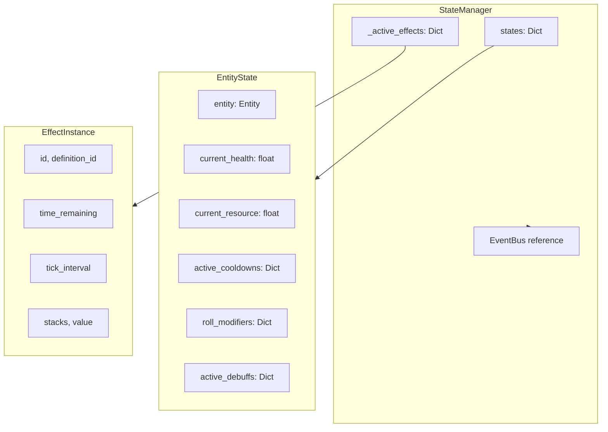
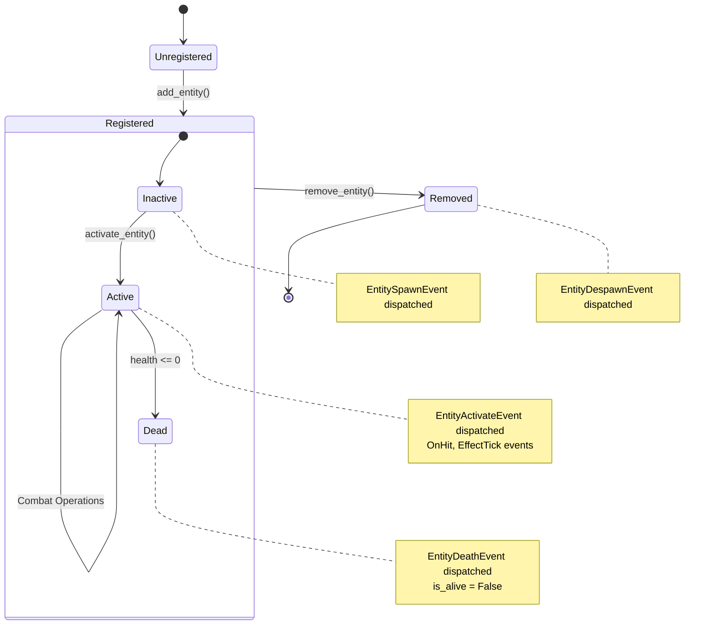

# State Management and Entity Lifecycle

*Complete guide to the StateManager and entity lifecycle events*

## Overview

The `StateManager` is the centralized system for tracking all dynamic entity state in the  combat engine. It manages health, resources, cooldowns, effects, and dispatches lifecycle events through the `EventBus`.

**Key Responsibilities:**
- Entity registration and lifecycle management
- Health and resource tracking
- Effect application and ticking
- Cooldown management
- Event dispatching for state changes

## StateManager Architecture



## Entity Lifecycle

### Lifecycle States

Entities go through a well-defined lifecycle with event dispatching at each transition:



### Lifecycle Methods

#### 1. Registration: `add_entity(entity)`

Registers an entity with the state manager and initializes its state.

**Code Location**: [`src/core/state.py:L87-L100`](file:///g:/Godot%20Projects/combat_engine/src/core/state.py#L87-L100)

**Actions:**
- Creates `EntityState` with initial values
- Sets `current_health` to `max_health`
- Sets `current_resource` to `max_resource` 
- Dispatches `EntitySpawnEvent`

**Example:**
```python
from src.core.state import StateManager
from src.core.events import EventBus

event_bus = EventBus()
state_manager = StateManager(event_bus)

# Register an entity
state_manager.add_entity(hero)

# EntitySpawnEvent is automatically dispatched
# Subscribers can react to entity entering the system
```

**EntitySpawnEvent:**
```python
@dataclass
class EntitySpawnEvent(Event):
    entity: Entity
```

#### 2. Activation: `activate_entity(entity_id)`

Signals that an entity is ready for combat.

**Code Location**: [`src/core/state.py:L102-L110`](file:///g:/Godot%20Projects/combat_engine/src/core/state.py#L102-L110)

**Actions:**
- Validates entity is registered
- Dispatches `EntityActivateEvent`

**Example:**
```python
# Ready the entity for combat
state_manager.activate_entity("hero")

# EntityActivateEvent can trigger:
# - UI updates (health bar appears)
# - Combat initialization
# - AI activation
```

**EntityActivateEvent:**
```python
@dataclass
class EntityActivateEvent(Event):
    entity: Entity
```

#### 3. Combat Operations (Active State)

Once active, entities can:
- Take damage (`apply_damage()`)
- Consume/gain resources (`spend_resource()`, `add_resource()`)
- Have effects applied (`apply_effect()`)
- Use skills with cooldowns (`set_cooldown()`)

See [Combat Operations](#combat-operations) section below.

#### 4. Death: `is_alive = False`

When an entity's health reaches zero, death is automatically handled.

**Code Location**: [`src/core/state.py:L166-L173`](file:///g:/Godot%20Projects/combat_engine/src/core/state.py#L166-L173)

**Actions:**
- Sets `is_alive = False`
- Sets `current_health = 0`
- Dispatches `EntityDeathEvent` (only once)

**Example:**
```python
# Apply fatal damage
state_manager.apply_damage("monster", 9999.0)

# EntityDeathEvent automatically dispatched
# Subscribers can handle:
# - Loot drops
# - Experience gain
# - Quest updates
# - Victory conditions
```

**EntityDeathEvent:**
```python
@dataclass
class EntityDeathEvent(Event):
    entity_id: str
```

#### 5. Removal: `remove_entity(entity_id)`

Cleanly removes an entity from the system.

**Code Location**: [`src/core/state.py:L112-L126`](file:///g:/Godot%20Projects/combat_engine/src/core/state.py#L112-L126)

**Actions:**
- Removes entity state
- Removes all active effects
- Dispatches `EntityDespawnEvent`

**Example:**
```python
# Clean up after combat
state_manager.remove_entity("monster")

# EntityDespawnEvent dispatched
# Use for:
# - Memory cleanup
# - Unregistering event listeners
# - Removing from spatial systems
```

**EntityDespawnEvent:**
```python
@dataclass
class EntityDespawnEvent(Event):
    entity_id: str
```

## Combat Operations

### Health Management

#### `apply_damage(entity_id, damage) -> float`

Applies damage and returns actual damage dealt.

**Features:**
- Automatic death detection
- Dead entities take no damage
- Returns actual damage (accounting for overkill)

**Code Location**: [`src/core/state.py:L148-L175`](file:///g:/Godot%20Projects/combat_engine/src/core/state.py#L148-L175)

**Example:**
```python
# Apply 150 damage
actual_damage = state_manager.apply_damage("monster", 150.0)

# If monster had 100 HP:
# current_health: 100 -> 0
# actual_damage: 100.0 (not 150.0)
# is_alive: True -> False
# EntityDeathEvent dispatched
```

#### `set_health(entity_id, health)`

Directly sets health (useful for healing or testing).

**Example:**
```python
# Full heal
state_manager.set_health("hero", hero.final_stats.max_health)

# Set specific value
state_manager.set_health("hero", 50.0)
```

#### `get_current_health(entity_id) -> float`

Query current health value.

**Example:**
```python
health = state_manager.get_current_health("hero")
print(f"HP: {health}/{hero.final_stats.max_health}")
```

### Resource Management

Resources are used for skill costs and active gameplay mechanics.

#### `spend_resource(entity_id, amount) -> bool`

Attempts to spend resource, returns `True` if successful.

**Code Location**: [`src/core/state.py:L190-L196`](file:///g:/Godot%20Projects/combat_engine/src/core/state.py#L190-L196)

**Example:**
```python
# Try to use skill costing 30 resource
if state_manager.spend_resource("hero", 30.0):
    # Execute skill
    engine.process_skill_use(...)
else:
    print("Insufficient resource!")
```

#### `add_resource(entity_id, amount)`

Adds resource, clamped to `max_resource`.

**Example:**
```python
# Award resource on hit
state_manager.add_resource("hero", hero.final_stats.resource_on_hit)

# Resource on kill
state_manager.add_resource("hero", hero.final_stats.resource_on_kill)
```

#### `set_resource(entity_id, amount)`

Directly sets resource value.

**Example:**
```python
# Start combat at full resource
state_manager.set_resource("hero", hero.final_stats.max_resource)
```

### Cooldown Management

#### `set_cooldown(entity_id, skill_name, cooldown_seconds)`

Sets a skill on cooldown.

**Code Location**: [`src/core/state.py:L203-L206`](file:///g:/Godot%20Projects/combat_engine/src/core/state.py#L203-L206)

**Example:**
```python
# Put skill on 10 second cooldown
state_manager.set_cooldown("hero", "Whirlwind", 10.0)

# Apply cooldown reduction
cdr = hero.final_stats.cooldown_reduction  # 0.2 = 20% reduction
actual_cooldown = 10.0 * (1.0 - cdr)  # 8.0 seconds
state_manager.set_cooldown("hero", "Whirlwind", actual_cooldown)
```

#### `get_cooldown_remaining(entity_id, skill_id) -> float`

Query remaining cooldown time.

**Example:**
```python
remaining = state_manager.get_cooldown_remaining("hero", "Whirlwind")
if remaining == 0:
    print("Ready to cast!")
else:
    print(f"On cooldown: {remaining:.1f}s")
```

## Effect System

The `StateManager` tracks `EffectInstance` objects which represent active buffs, debuffs, and DoTs.

### EffectInstance Data Structure

```python
@dataclass
class EffectInstance:
    id: str                    # Unique instance ID
    definition_id: str         # Effect type (e.g., "Bleed")
    source_id: str            # Who applied it
    time_remaining: float
    tick_interval: float      # Seconds between ticks (0 for no ticks)
    accumulator: float = 0.0  # Time accumulator for ticking
    stacks: int = 1
    value: float = 0.0        # Damage per tick, stat modifier, etc.
    expires_on_zero: bool = True
```

### Effect Application

#### `apply_effect(entity_id, effect) -> Dict`

Applies an effect instance to an entity.

**Code Location**: [`src/core/state.py:L228-L250`](file:///g:/Godot%20Projects/combat_engine/src/core/state.py#L228-L250)

**Behavior:**
- If effect exists: stacks added, duration refreshed to max
- If new: effect is added
- Dispatches `EffectApplied` event

**Example:**
```python
import uuid
from src.core.models import EffectInstance

# Create a Bleed effect
bleed = EffectInstance(
    id=str(uuid.uuid4()),
    definition_id="Bleed",
    source_id="hero",
    time_remaining=10.0,
    tick_interval=1.0,
    stacks=2,
    value=5.0  # 5 damage per tick per stack
)

result = state_manager.apply_effect("monster", bleed)
# result: {"success": True, "action": "applied", "new_stacks": 2}

# Apply again
result = state_manager.apply_effect("monster", bleed)
# result: {"success": True, "action": "refreshed", "new_stacks": 4}
# Duration refreshed to 10.0, stacks now 4
```

**EffectApplied Event:**
```python
@dataclass
class EffectApplied(Event):
    entity_id: str
    effect: EffectInstance
```

### Effect Ticking and Expiration

#### `update(delta_time, event_bus=None)`

Advances simulation time, processing cooldowns and effects.

**Code Location**: [`src/core/state.py:L252-L315`](file:///g:/Godot%20Projects/combat_engine/src/core/state.py#L252-L315)

**Process:**

1. **Update Cooldowns**: Decrement all active cooldowns by `delta_time`
2. **Update Effects**: For each active effect:
   - Decrement `time_remaining`
   - Increment `accumulator` by `delta_time`
   - When `accumulator >= tick_interval`:
     - Apply tick damage: `damage = value * stacks`
     - Dispatch `EffectTick` event
     - Reset accumulator
   - When `time_remaining <= 0`:
     - Dispatch `EffectExpired` event
     - Remove effect

**Example:**
```python
# Simulation loop
delta_time = 0.1  # 100ms per frame

while combat_active:
    # Process time-based updates
    state_manager.update(delta_time, event_bus)
    
    # EffectTick events dispatched for DoTs
    # EffectExpired events when effects end
```

**Effect Events:**

```python
@dataclass
class EffectTick(Event):
    entity_id: str
    effect: EffectInstance
    damage_applied: float
    stacks: int

@dataclass
class EffectExpired(Event):
    entity_id: str
    effect: EffectInstance
```

**Timing Example:**

```
Bleed: 5 damage/tick, 1.0s interval, 10.0s duration, 3 stacks

Time 0.0s: Applied (time_remaining=10.0, accumulator=0.0)
Time 1.0s: Tick! (15 damage applied, accumulator reset)
Time 2.0s: Tick! (15 damage)
...
Time 9.0s: Tick! (15 damage)
Time 10.0s: Tick! (15 damage), then EXPIRED
          Total: 10 ticks × 15 damage = 150 damage
```

### Effect Queries

#### `get_active_effects(entity_id) -> List[EffectInstance]`

Returns all active effects on an entity.

**Example:**
```python
effects = state_manager.get_active_effects("monster")
for effect in effects:
    print(f"{effect.definition_id}: {effect.stacks} stacks, {effect.time_remaining:.1f}s")

# Output:
# Bleed: 3 stacks, 7.2s
# Poison: 1 stack, 5.0s
```

#### `get_effect_stacks(entity_id, effect_id) -> int`

Get stack count for a specific effect.

**Example:**
```python
bleed_stacks = state_manager.get_effect_stacks("monster", "Bleed")
if bleed_stacks >= 5:
    print("Bleed stacks critical!")
```

#### `remove_effect(entity_id, effect_id) -> bool`

Manually remove an effect.

**Example:**
```python
# Cleanse debuff
state_manager.remove_effect("hero", "Curse")
```

#### `clear_all_effects(entity_id) -> int`

Remove all effects from an entity.

**Example:**
```python
# Full cleanse
count = state_manager.clear_all_effects("hero")
print(f"Removed {count} effects")
```

## Modifiers System

The `StateManager` tracks temporary modifiers that affect roll chances (crit, evasion, block).

**Structure:**
```python
@dataclass
class Modifier:
    value: float      # +0.1 for +10% chance
    duration: float   # Seconds remaining
    source: str       # "buff_name" for tracking
```

**Usage:**

```python
from src.core.state import Modifier

# Apply +15% crit chance for 5 seconds
state = state_manager.get_state("hero")
modifier = Modifier(value=0.15, duration=5.0, source="battle_fury")

if 'crit_chance' not in state.roll_modifiers:
    state.roll_modifiers['crit_chance'] = []
state.roll_modifiers['crit_chance'].append(modifier)

# CombatEngine._get_modified_chance() will read these modifiers
# to calculate final chance = base_chance + sum(modifiers)
```

**Modifier Types:**
- `crit_chance`: Critical hit chance
- `evasion_chance`: Evasion chance
- `dodge_chance`: Dodge chance
- `block_chance`: Block chance

Modifiers are automatically decremented during `update()` and removed when duration expires.

## System Reset

### `reset_system()`

Clears all entities and effects for simulation resets.

**Code Location**: [`src/core/state.py:L139-L142`](file:///g:/Godot%20Projects/combat_engine/src/core/state.py#L139-L142)

**Example:**
```python
# Clean slate for new simulation
state_manager.reset_system()

# All states and effects cleared
# Ready for new entity registration
```

**Critical for Batch Simulations:**
```python
from src.simulation.batch_runner import SimulationBatchRunner

# Runs 1000 simulations
# reset_system() called between each to prevent state leakage
batch_runner = SimulationBatchRunner(base_seed=42)
results = batch_runner.run_batch(1000)
```

## Integration with EventBus

The `StateManager` is tightly integrated with the `EventBus` for lifecycle events:

```python
# Constructor accepts optional EventBus
state_manager = StateManager(event_bus)

# Events automatically dispatched:
# - add_entity() → EntitySpawnEvent
# - activate_entity() → EntityActivateEvent
# - apply_damage() (death) → EntityDeathEvent
# - remove_entity() → EntityDespawnEvent
# - apply_effect() → EffectApplied
# - update() (ticking) → EffectTick
# - update() (expiration) → EffectExpired
```

**Event Subscribers Example:**

```python
from src.core.events import EventBus
from src.handlers.effect_handlers import BleedHandler

event_bus = EventBus()
state_manager = StateManager(event_bus)

# Handler subscribes to OnHit events
bleed_handler = BleedHandler(event_bus, state_manager)

# When damage is dealt:
# 1. CombatEngine dispatches OnHitEvent
# 2. BleedHandler receives event
# 3. BleedHandler calls state_manager.apply_effect()
# 4. StateManager dispatches EffectApplied
# 5. Logging/UI systems can react
```

See [Architecture Overview](file:///g:/Godot%20Projects/combat_engine/docs/architecture.md) for complete event flow diagrams.

## Code Reference

**Main Implementation:**
- [`src/core/state.py`](file:///g:/Godot%20Projects/combat_engine/src/core/state.py) - Complete StateManager

**Related Systems:**
- [`src/core/events.py`](file:///g:/Godot%20Projects/combat_engine/src/core/events.py) - Event definitions
- [`src/core/models.py`](file:///g:/Godot%20Projects/combat_engine/src/core/models.py) - EntityState, EffectInstance

**Testing:**
- [`tests/test_state.py`](file:///g:/Godot%20Projects/combat_engine/tests/test_state.py) - StateManager unit tests
- [`tests/test_lifecycle.py`](file:///g:/Godot%20Projects/combat_engine/tests/test_lifecycle.py) - Lifecycle event tests

## Best Practices

### 1. Always Register Entities Before Use

```python
# ❌ Wrong
state_manager.apply_damage("hero", 50.0)  # KeyError!

# ✅ Correct
state_manager.add_entity(hero)
state_manager.apply_damage("hero", 50.0)
```

### 2. Use activate_entity() for Combat Initialization

```python
# Register both entities
state_manager.add_entity(hero)
state_manager.add_entity(monster)

# Activate when combat starts
state_manager.activate_entity("hero")
state_manager.activate_entity("monster")

# Subscribers can initialize UI, start AI, etc.
```

### 3. Clean Up After Combat

```python
# When combat ends
state_manager.remove_entity("monster")

# For simulations, use full reset
state_manager.reset_system()
```

### 4. Check is_alive Before Operations

```python
state = state_manager.get_state(target_id)
if state.is_alive:
    # Apply effects, damage, etc.
    pass
```

### 5. Use update() for Time-Based Systems

```python
# Game loop
last_time = time.time()
while running:
    current_time = time.time()
    delta_time = current_time - last_time
    last_time = current_time
    
    # Process all time-based effects
    state_manager.update(delta_time, event_bus)
```

---

**Related Documentation:**
- [Architecture Overview](file:///g:/Godot%20Projects/combat_engine/docs/architecture.md)
- [Damage Pipeline](file:///g:/Godot%20Projects/combat_engine/docs/damage_pipeline.md)
- [Data Pipeline](file:///g:/Godot%20Projects/combat_engine/docs/data_pipeline.md)

**Last Updated**: November 20, 2025  
**Version**: Combat Engine v2.5.0
